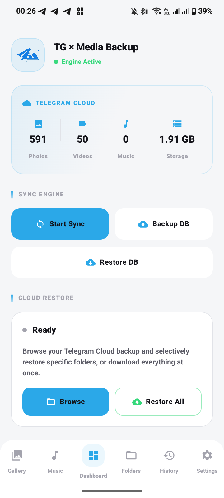
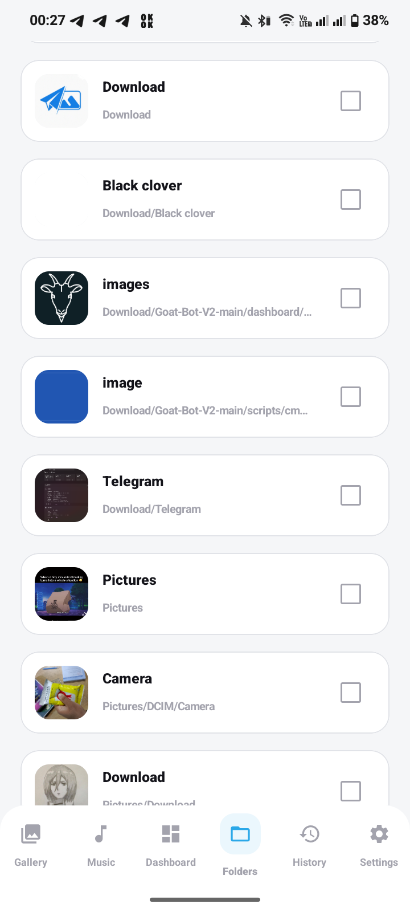
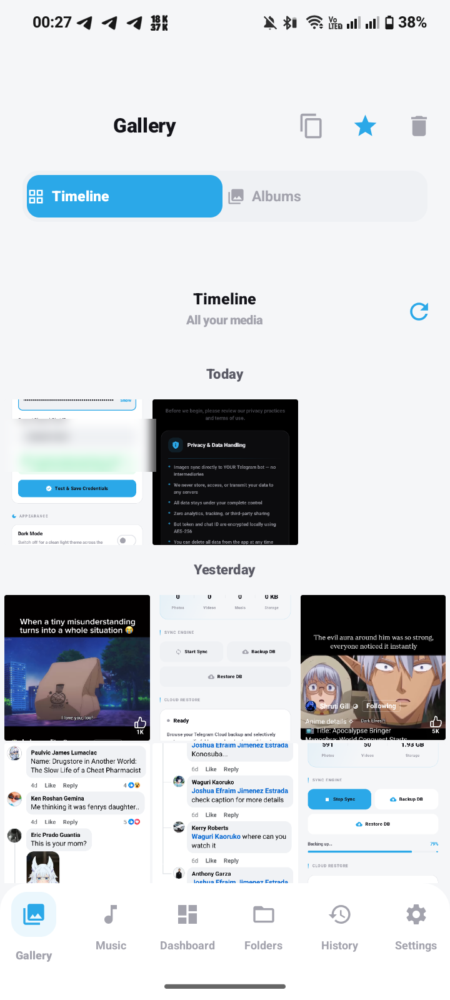
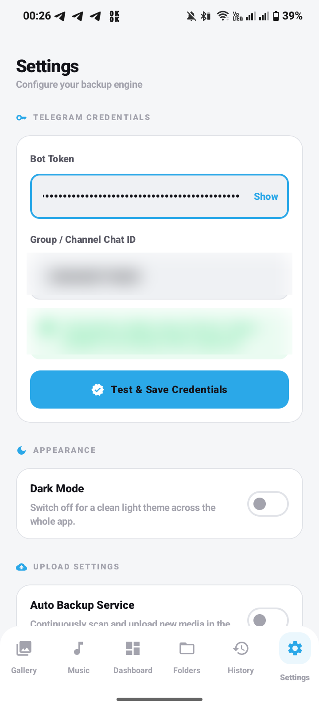
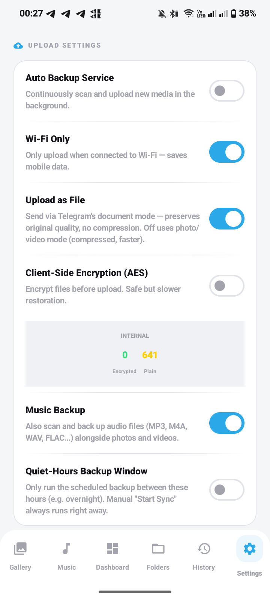
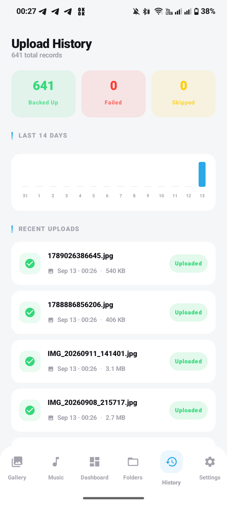
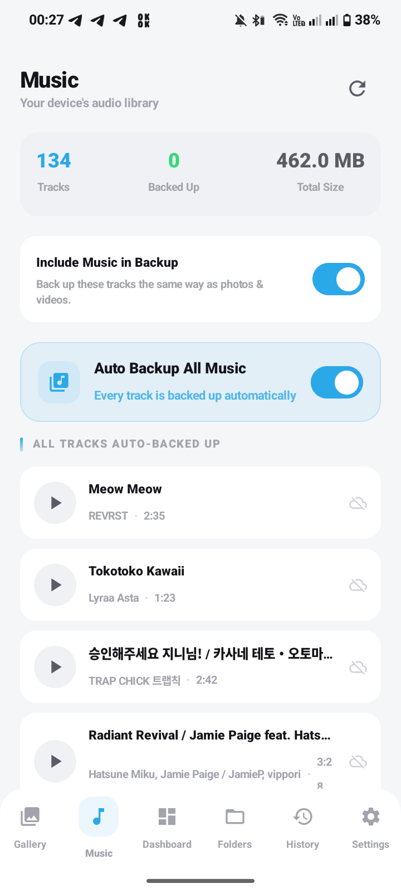

# TG × Media Backup — Android (Native Kotlin) `v3.1.0`

**TG × Media Backup** is a powerful, privacy-focused media backup solution for Android. It transforms a Telegram Group into your own personal, unlimited cloud storage, organizing your photos, videos, and music into structured Topics that mirror your device's folder hierarchy.

---

## ✨ Key Features

- **📂 Folder-to-Topic Organization**: Automatically creates Telegram Forum Topics for every folder on your device. Your backup stays organized exactly like your phone.
- **🔍 File Manager Grade Scanning**: Uses `MANAGE_EXTERNAL_STORAGE` to discover media deep within your storage, including subfolders that standard gallery apps often miss.
- **🧩 Automatic Split-Upload for Large Files** *(toggle in Settings)*: Files over Telegram Bot API's 50MB limit are chunked (≤18MB pieces, kept under Telegram's 20MB *download* ceiling), uploaded as a sequence, and reassembled + SHA-256-verified automatically on restore. Turn this off in Settings → Upload Settings → "Split-Upload Large Files" if you'd rather large files were simply skipped (shown as "Too Large" in history) instead of chunked.
- **🛡️ SHA-256 Deduplication**: Every file is hashed before upload. If you move or rename a file, the app recognizes it and skips re-uploading, saving data and time.
- **🔄 Organized Restore**: When downloading media back to your device, the app re-creates the original folder structure based on the Telegram Topic names.
- **☁️ Cloud History Sync**: Encrypts and uploads your upload database to your Telegram group as a pinned message. Switching phones? Just "Restore History" to pick up where you left off.
- **🔁 Migrate to a New Bot**: If your bot token ever gets revoked or lost, recover everything under a brand-new bot — without ever needing the old token. The app finds your pinned DB backup (or you import it manually), re-links every file via Telegram's `forwardMessage`, and cleans up the old duplicate messages so the group stays tidy.
- **🎵 Dedicated Music Section**: Browse your device's full audio library in its own tab — play tracks inline, see backup status per song, and toggle music backup right there (not buried in Settings).
- **⚡ Background Engine**: Powered by Android WorkManager. Handles network retries, exponential backoff, and respects Wi-Fi/Battery constraints automatically.
- **🔐 Security First**: Telegram credentials are encrypted using **AES-256-GCM** via the Android Keystore System. Your tokens never leave your device — and as of v3.0.0, the cloud DB backup file itself no longer contains your bot token, chat ID, or encryption key either.

---

## 🚀 What's New in v3.1.0

- **🧩 Automatic Split-Upload**: Large files (videos, big archives, etc.) that used to be marked "too large" are now automatically chunked and uploaded — fully transparent on both the upload and restore side.
- **🔁 Bot Migration Engine**: A completely new "Migrate to New Bot" flow in Settings. Recovers your full backup history onto a fresh bot token using Telegram's `forwardMessage` trick — the old (revoked) bot's token is never required. Includes a manual `.json` backup import fallback for when auto-discovery can't find a pinned backup.
- **🧹 "Keep Only Latest Backup" Setting**: Optionally auto-deletes the previous DB backup message every time a new one is pushed, so your group doesn't accumulate old snapshots over time.
- **🔒 Security Fix**: The DB backup JSON uploaded to your Telegram group no longer contains your bot token, chat ID, or encryption key in plaintext. Restoring on a new device (outside of the migration flow) now requires re-entering these by hand, exactly as it should.
- **🎨 Proper Adaptive Icon**: The launcher icon has been rebuilt as a true Android Adaptive Icon — transparent foreground layer, correctly centered within the safe zone, with a monochrome variant for Android 13+ themed icons. No more mismatched white box on some launchers/themes.
- **🎵 Music Section**: A brand-new dedicated tab for browsing and playing your device's music library, with per-track backup status and an inline "Include in Auto Backup" toggle.

---

## 📸 Screenshots

| Dashboard | Folders | Gallery |
|---|---|---|
|  |  |  |

| Settings | Upload Settings | History | Music |
|---|---|---|---|
|  |  |  |  |

## 🛠️ Technical Stack

- **UI**: Jetpack Compose (Material 3) with a Premium Pitch Black theme.
- **Database**: Room (SQLite) for tracking millions of file hashes efficiently, including per-chunk metadata for split-uploaded files.
- **Background**: WorkManager for robust periodic syncing, restoring, and bot migration.
- **Network**: OkHttp for multipart Telegram Bot API communication (upload, download, forward, delete).
- **Security**: Android Jetpack Security (EncryptedSharedPreferences) + AES-256-GCM.
- **Language**: 100% Kotlin with Coroutines & Flow.

---
⚠️ UI/UX Disclaimer

This project was built as a hobby solution to my own cloud storage problem. 
All core features (backup, restore, resume/pause, split-upload, bot migration, cloud DB sync) 
work reliably and are the main focus of the app.

That said, the UI/UX is not polished like a professional app. 
I’m not a designer, so please forgive the rough edges. 
Functionality comes first here — design compromises were made.

Thanks for understanding, and I hope the app still proves useful! 


---

## 🚀 Getting Started

### 1. Requirements
- **Android Studio**: Hedgehog 2023.1.1+
- **Min Android**: 8.0 (API 26)
- **Target Android**: 15 (API 35)
- **Java**: JDK 17+

### 2. Telegram Setup
1. **Create a Bot**: Message [@BotFather](https://t.me/botfather) on Telegram, send `/newbot`, and save the **Bot Token**.
2. **Create a Group**: Create a new Telegram Group (or use an existing one).
3. **Enable Topics**: Go to Group Settings → **Edit** → Enable **Topics** (Forum mode). This is required for folder organization.
4. **Add Bot**: Add your bot as an **Administrator** with permission to "Post Messages", "Manage Topics", and **"Delete Messages"** (the last one is needed for bot migration and the "Keep Only Latest Backup" cleanup feature).
5. **Get Chat ID**: Forward any message from your group to [@userinfobot](https://t.me/userinfobot) to get the Chat ID (starts with `-100`).

### 3. Build & Run
1. Clone this repository.
2. Open in Android Studio and let Gradle Sync finish.
3. Build and install on your device.
4. Enter your Bot Token and Chat ID in the **Settings** tab.
5. Grant **All Files Access** when prompted to allow the app to scan your folders.

> **Note**: Room's database migration (v7 → v8, adding split-upload support) runs automatically — no need to clear app data when upgrading from an older version.

---

## 📋 Permissions Explained

| Permission | Why? |
|---|---|
| `MANAGE_EXTERNAL_STORAGE` | Required to scan all folders and subfolders for media, acting as a file manager. |
| `READ_MEDIA_IMAGES` / `READ_MEDIA_VIDEO` / `READ_MEDIA_AUDIO` | Access photos, videos, and music on Android 13+. |
| `INTERNET` | To communicate with the Telegram Bot API. |
| `FOREGROUND_SERVICE` | Ensures sync, restore, and migration don't get killed by Android during long-running operations. |
| `RECEIVE_BOOT_COMPLETED` | Automatically restarts the background sync schedule after you reboot your phone. |
| `POST_NOTIFICATIONS` | Shows real-time upload/restore/migration progress and completion status. |

---

## 📁 Project Structure

```text
app/src/main/java/com/dparadox/tgbackup/
├── data/
│   ├── AppDatabase.kt      — Room DB for upload tracking (v8: includes split-file chunks)
│   ├── FilePart.kt         — Per-chunk metadata for split-uploaded large files
│   ├── DbBackupManager.kt  — Shared, security-fixed cloud DB backup builder
│   ├── FileSyncEngine.kt   — Recursive storage scanning & hashing
│   └── SettingsManager.kt  — Encrypted credential storage
├── network/
│   └── TelegramApi.kt      — Topic creation, upload/download, forward & delete logic
├── worker/
│   ├── SyncWorker.kt          — The background backup engine (incl. split-upload)
│   ├── DownloadWorker.kt      — The organized restoration engine (incl. auto-reassembly)
│   ├── DatabaseBackupWorker.kt — Scheduled cloud DB backup
│   └── MigrationWorker.kt     — Recovers backup history onto a new bot token
└── ui/
    ├── MainViewModel.kt    — Reactive state management (incl. music playback)
    └── screens/
        ├── DashboardScreen.kt — Real-time stats & controls
        ├── MusicScreen.kt     — Music library browser & inline player
        ├── FoldersScreen.kt   — Manual folder selection UI
        └── SettingsScreen.kt  — Configuration, toggles & bot migration
```

---

## ⚠️ Troubleshooting

- **Folders not showing?**: Ensure you have granted "All Files Access" in the Status tab.
- **Topic creation failed?**: Make sure your Telegram Group has **Topics/Forum** mode enabled and the bot is an **Admin**.
- **Background sync delayed?**: Android may delay WorkManager tasks if Battery Optimization is on. Tap "Disable Battery Optimization" in Settings for instant background runs.
- **Bot revoked/lost?**: Use Settings → "Migrate to New Bot". Add the new bot as admin (with delete-messages permission) to the same group first.
- **Music tab empty?**: Make sure you've granted the audio permission when prompted (Android 13+ requires `READ_MEDIA_AUDIO` separately from photos/videos).

---

## ⚠️ A Note on Telegram's Terms

This app uses Telegram Bot API purely as a personal file-storage backend. That's not explicitly against Telegram's ToS, but bulk/automated file storage sits in a gray area Telegram could tighten up on at any time — treat this as a convenient personal backup, not guaranteed permanent storage, and keep a real backup elsewhere for anything irreplaceable.

---

## ⚖️ License & Privacy
This project is licensed under the [MIT License](LICENSE) — see the file for details. This license applies to all versions of this project, past and present, regardless of whether an individual commit or tag included a copy of the license file. This app is provided "as-is" for personal backup purposes. We do not collect any data. All credentials and media paths stay on your device or in your private Telegram group — and as of v3.0.0, the cloud backup file itself carries no secrets either.
